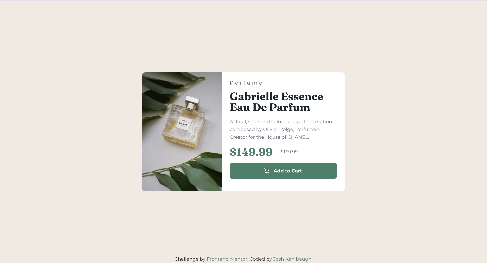

# Frontend Mentor - Product preview card component solution

This is a solution to the [Product preview card component challenge on Frontend Mentor](https://www.frontendmentor.io/challenges/product-preview-card-component-GO7UmttRfa). Frontend Mentor challenges help you improve your coding skills by building realistic projects.

## Table of contents

-   [Overview](#overview)
    -   [The challenge](#the-challenge)
    -   [Screenshot](#screenshot)
    -   [Links](#links)
-   [My process](#my-process)
    -   [Built with](#built-with)
    -   [What I learned](#what-i-learned)
    -   [Continued development](#continued-development)
    -   [Useful resources](#useful-resources)
-   [Author](#author)

## Overview

### The challenge

Users should be able to:

-   View the optimal layout depending on their device's screen size
-   See hover and focus states for interactive elements

### Screenshot



### Links

-   Solution URL: [Solution](https://github.com/Joshk7/product-preview-card)
-   Live Site URL: [Live Site](https://product-preview-card-theta-six.vercel.app/)

## My process

I decided to go with a mobile first design path for this project and it worked really nicely because the media
queries I used to make the images responsive didn't take up too many lines. Additionally, I decided to try Sass/Scss
in this project and found that Scss isn't much different from vanilla css except you can nest selectors, use modules,
and make placeholder selectors that remind me of interfaces in traditional programming languages. Once I read up on
Sass and Scss, I started making variables for fonts and colors. Then I went through the html file along with the figma
file to see if any elements were nested in parent elements. Once the html tags were laid out, I went through the mobile designs and expanded upon them for desktop.

### Built with

-   Semantic HTML5 markup
-   CSS custom properties
-   Flexbox
-   Sass/Scss
-   Mobile-first workflow

**Note: These are just examples. Delete this note and replace the list above with your own choices**

### What I learned

After reading through the responsive layout overview on web.dev, I learned how you can nest img and source tags
within picture tags.

```html
<picture>
    <source srcset="./desktop-image.jpg" media="(min-width: 40rem)" />
    
</picture>
```

You'll notice that there's a media query in the html file which allows the page to choose the correct image
quickly. Additionally, the eager loading and high fetchpriority values ensure that the page optimizes the loading
of the image.

Further into the project I tried using a feature of sass that allows you to nest selectors:

```css
.prices {
    strong {
        font: $display;
        color: $aquamarine;
    }

    s {
        font: $body;
        color: $aurometal;
    }
}
```

While this might seem overkill for this challenge, I could definitely see how Scss could be useful for more
complicated projects.

### Continued development

Ideas for this project would be to implement theme colors for dark and light browser theme preferences.

### Useful resources

-   [The Picture Element](https://web.dev/learn/design/picture-element) - This helped me learn about the picture element and how you can specify different sources for it.
-   [Icons](https://web.dev/learn/design/icons) - I took a brief look at this resource for the shopping cart icon.

## Author

-   Website - [Josh Kahlbaugh](https://joshuakahlbaugh.pages.dev/)
-   Frontend Mentor - [@Joshk7](https://www.frontendmentor.io/profile/Joshk7)
